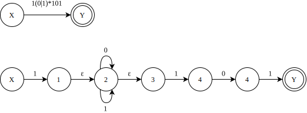
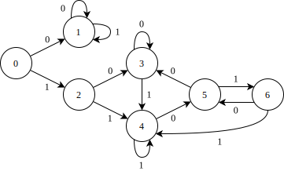
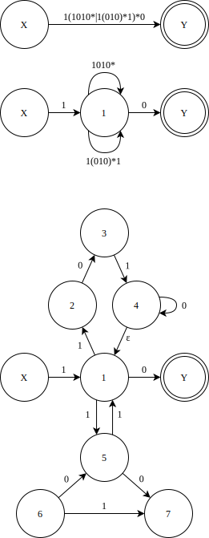
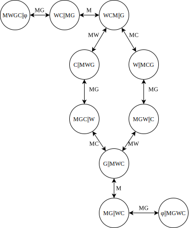
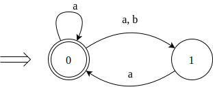
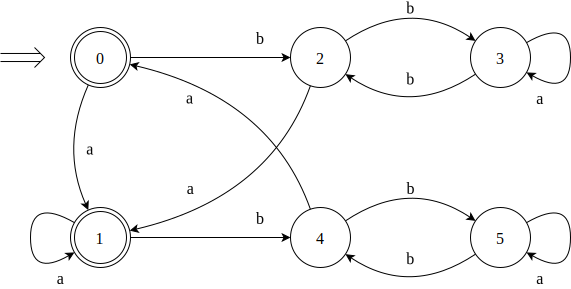

# 作业 02 - 第三章作业

- P64: 7, 8, 12, 14 (22/3/22) 作业下一次课讲完后，才能做
- P64: 7, 8, 10 (22/3/29)
- P64: 12, 14 (22/4/12)

---

7\. 构造下列正规式相应的 DFA

1\(0\|1\)\*101

1\(1010\*|1\(010\)\*1\)\*0

0\*10\*10\*10*

\(00\|11\)\*\(\(01\|10\)\(00\|11\)\*\(01\|10\)\(00\|11\)\*)\*

**解:**

(1)

确定化:

| I | I0 | I1 | K | 0 | 1|
| :-------: | :-----: | :---------: | :---: | :---: | :---: |
| {X}       | φ       | {1, 2, 3}   | 0     | 1 | 2 |
|  φ        | φ       | φ           | 1     | 1 | 1 |
| {1,2,3}   | {2,3}   | {2,3,4}     | 2     | 3 | 4 |
| {2,3}     | {2,3}   | {2,3,4}     | 3     | 3 | 4 |
| {2,3,4}   | {2,3,5} | {2,3,4}     | 4     | 5 | 4 |
| {2,3,5}   | {2,3}   | {2,3,4,Y}   | 5     | 3 | 6 |
| {2,3,4,Y} | {2,3,5} | {2,3,4}     | 6     | 5 | 4 | 

由状态子集转换矩阵可知, 状态 2 和 3 是等价的, 而状态 4 和 6 是等价的. 因此,合并等价状态之后只剩下 5 个状态, 也即是最少状态的 DFA.

(2) 构造正规表达式的 NFA

---

8\. 给出下面正规表达式:

(1) 以 01 结尾的二进制数串;\
(2) 能被5整除的十进制整数;\
(3) 包含奇数个 1 或奇数个 0 的二进制数串;\
(4) 英文字母组成的所有符号串, 要求符号串中的字母依照字典序排列;\
(5) 没有重复出现的数字的数字符号串的全体;\
(6) 最多有一个重复出现的数字的数字符号串的全体;\
(7) 不包含子串 abb 的由 a 和 b 组成的符号串的全体.\

**解:**

(1) (0|1)\*01

(2) (1|2|3|4|5|6|7|8|9)(0|1|2|3|4|5|6|7|8|9)\*(0|5)|(0|5)

(3) 由奇数个 1 的二进制数串可表示为 1(11)\*, 向其中填入 0 可得 0\*1(0\*|10\*1)\*;

同理可得, 奇数 0 的二进制数串可表示为 1\*0(1\*|01\*0)\*. 

综上, 包含奇数个 1 或奇数个 0 的二进制数串的正规表达式为 0\*1(0\*|10\*1)\*|1\*0(1\*|01\*0)\*.

(4) a\*b\*c\* ... x\*y\*z\*

---

10\. 一个人带着狼, 山羊和白菜在一条河的左岸. 有一条船,
大小正好能装下这个人和其它三件东西中的一件. 人和他的随行物都要过到河的右岸. 
人每次只能将一件东西摆渡过河. 但若人将狼和羊留在同一岸而无人照顾的话, 
狼将把羊吃掉. 类似地, 若羊和白菜留下来无人照看, 羊将会吃掉白菜. 请问是否有可能渡过河去, 
使得羊和白菜都不被吃掉? 如果可能, 请用有限自动机写出渡河的方法.

**解:**

令人=M, 狼=W, 山羊=G, 白菜=C. 字符集为每次渡河的成员, 故 Σ={M, MW, MG, MC}.

状态集为河边和对岸的情况, 用双竖线表示河. 因此, 开始状态为: MWGC || φ, 接受状态为: φ || MWGC.

DFA图如下:

---

12\. 将图 3.18 的 (a) 和 (b) 分别确定化和最少化.

<figure>
<table class='timg'>

<tr>
  <td></td>
  <td></td>
</tr>
<tr><td>(a)</td><td>(b)</td></tr>
</table>
<figcaption>

图 3.18  有限自动机 
(a) 零确定化的有限自动机; (b) 需最小化的有限自动机

</figcaption>
</figure>

---

14\. 构造一个 DFA, 它接受 \\(\\Sigma = \\{0, 1\\}\\) 上所有满足如下条件的字符串: 每个 1 都有 0 直接跟在右边. 
